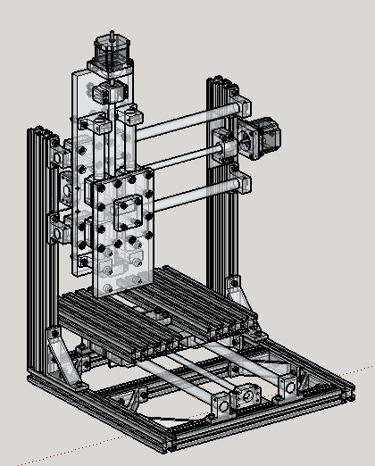

# CNCAlpha
Projeto de uma CNC para Hobby.
Iniciei este projeto com o intuito de facilitar a vida de quem está querendo começar a construir sua primeira máquina CNC.

#Objetivos
Criar uma máquina fresadora CNC para hobby que seja capaz de usinar madeira, PCB, acrílico, PVC e demais materiais macios.
Em uma outra etapa pretendo ter um modelo que seja capaz de usinar metais macios, como por exemplo, ligas de Alumínio.

#Especificações
 - Área de trabalho: X 240mm Y 230mm Z 80mm
 - Tensão de trabalho: 24V

#Softwares Utilizados
 - <a href="http://www.sketchup.com/products/sketchup-make" target="_blank">SketchUp Make 14</a>
 - <a href="http://www.3ds.com/products-services/draftsight-cad-software/free-download/" target="_blank">DraftSight V1R3.2</a>
 - <a href="http://www.cambam.info/" target="_blank">CamBam 0.9.4</a>

#Materiais
 As quantidades de materiais estão detalhadas no arquivo <a href="CNCAlpha-BOM.xlsx" target="_blank">CNCAlpha-BOM.xlsx</a>
 - <a href="http://pt.aliexpress.com/item/1204-Rolled-Ballscrew-set-1pcs-SFU1204-L350mm-61mm-machining-parts-1pcs-ballnut-end-machining-1set-BK10/476214507.html?recommendVersion=1" target="_blank">Fuso de esfera recirculante</a>
 - <a href="http://pt.aliexpress.com/item/Free-shipping-6pcs-SK20-20mm-Shaft-Support-CNC-Router-SH20A/1048914600.html?recommendVersion=1" target="_blank">SK20</a>
 - <a href="http://pt.aliexpress.com/item/New-4pcs-lot-Free-shipping-SC20UU-SCS20UU-20mm-Linear-Slide-Block-for-DIY-CNC-Router-linear/1267047427.html?recommendVersion=1" target="_blank">SCS20UU</a>
 - <a href="http://www.marvitubos.com.br/" target="_blank">Eixos lineares 20mm</a>
 - <a href="http://www.aliexpress.com/item/Free-Shipping-6-35mm-8mm-Stepper-Motor-Shaft-Coupler-6-35mmx8mm-flexible-shaft-couplings-3pcs-lot/32241418792.html" target="_blank">Acopladores 6,35x8mm</a>
 - <a href="http://www.casafer.com.br/produto-477-Parafuso+Allen+com+Cabeca+(DIN912)" target="_blank">Parafusos allen cabeça cilíndrica(DIN912)</a>
 - <a href="http://www.lojaforseti.com/produtos-index/categorias/1167688/perfil.html" target="_blank">Perfis de Alumínio 30x30mm e 30x60mm</a> 
 - <a href="http://www.lojaforseti.com/produtos-index/categorias/1434667/cantoneiras.html" target="_blank">Cantoneiras</a> 
 - <a href="http://www.lojaforseti.com/produtos-index/categorias/1506114/porcas.html" target="_blank">Porcas para os perfis de alumínio</a> 
 - <a href="http://www.aliexpress.com/item/Free-shipping-CNC-3-AXIS-Stepper-Driver-Board-Controller-TB6560-3-5A-SM362-CF/520301796.html" target="_blank">Placa controladora de 3 eixos</a>
 - <a href="http://www.aliexpress.com/store/product/3PCS-NEMA23-270-Oz-in-CNC-stepper-motor-stepping-motor-3-0A/907217_541699816.html" target="_blank">Motores Nema 23</a>
 - <a href="http://produto.mercadolivre.com.br/MLB-651414629-fonte-chaveada-12v-30a-360w-bivolt-p-cameras-fita-led-cftv-_JM" target="_blank">Fonte 12V 30A</a>
 - <a href="http://www.soldafria.com.br/chave-micro-switch-c-30_267.html" target="_blank">Endstops, fios</a>
 - <a href="http://www.aliexpress.com/item/2pcs-CNC-Emergency-Stop-Pushbutton-Switch-LAY37-11ZS/32331147402.html" target="_blank">Botão de emergência</a>
 - <a href="http://www.ebay.com/itm/ER11-Spindle-for-Sable-2015-SPD-ER11-ENGRAVER-mill-PCBs-engraving-/201337995174?pt=LH_DefaultDomain_0&hash=item2ee0adffa6" target="_blank">Spindle</a>

#Instruções para fabricação
 Os arquivos contendo os desenhos das peças que precisam ser fabricadas estão na pasta <a href="desenhos2D" target="_blank">desenho2D</a>.
 O objetivo é utilizar estes arquivos como base para a criação dos Gcodes, por isso não foram incluídos cotas e símbolos.
 Os arquivos Gcodes serão salvos na pasta <a href="cam" target="_blank">cam</a>
 Serão disponibilizados, também, os arquivos editáveis do CamBam.
 
#Observações
 - Tentei fazer todas as peças a serem fabricadas com o dimensional que fosse possível usinar através dela.
 - A mesa do eixo Y, devido ao seu tamanho, foi necessário realizar a usinagem em duas etapas.
 - Serão utilizadas duas fontes, ligadas em série, de 12V 30A para fornecer 24V aos motores e ao spindle.
 - Estou tentando fazer algo organizado e que seja útil para quem queira iniciar neste hobby, portanto qualquer ajuda e sugestão construtiva são muito bem vindos.